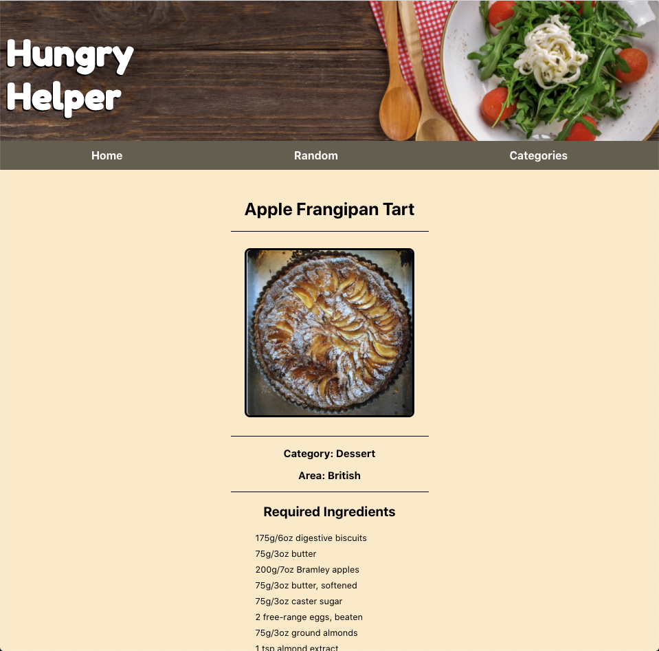
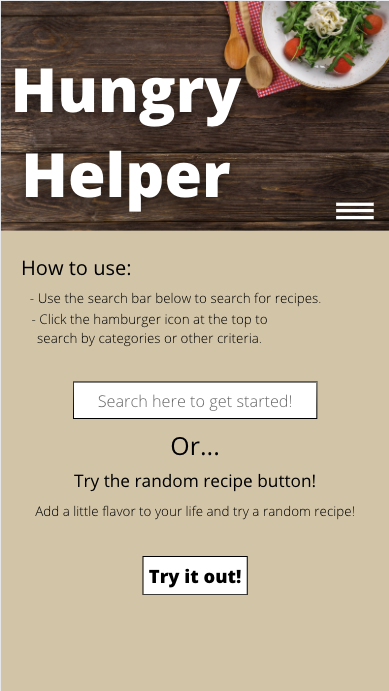
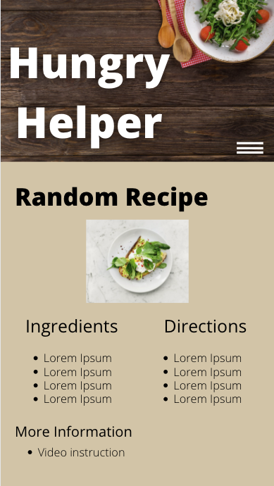
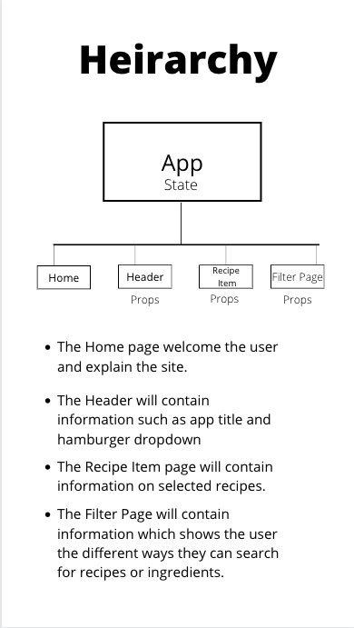

# Project 2 README

## Project Description
- Hungry Helper, is designed to provide users with numerous cooking recipes by allowing them to search for recipes based on categories, area, ingredients, etc. Users can also find random recipes if they feel like trying something new!

### Screenshot from the random section of the app

## User Stories
- As a user, I would like to be able to search for recipes, so that I am in control of what I look for.
- As a user, I would like to save my previous recipes, so that I can look back to them in the future.
- As a user, I would like to know what ingredients were needed, so that I can prepare in advance, and know what I am eating.
- As a user, I would like to see picture of the end result, so that I know what my food should look like.
- As a user, I would like to see categories of foods, so that I can look for recipes based on what I am hungry for.
- As a user, I would like detailed instructions on how to prepare the meal, so that I can follow along easy.
- As a user, I would like to know the dietary data, so that I can know how healthy the recipe is.
- As a user, I would like to be able to share the recipe, so that people I know can cook these recipes as well.

## Project Wireframe

## Heirarchy

 ## MVP Goals
- Allow users to find recipes based on categories.
- Display ingredients and instructions in an effective way.
- Create the random recipe function

## Stretch Goals
- Make the website stylish
- Allow users to search recipes in a search bar.
- Add sharing functionality to each recipe.
- Allow users to submit their own recipes for inclusion.
- Allow users to keep track of recipes they have completed.

## Technologies Used
- HTML5
- CSS3
- React Library